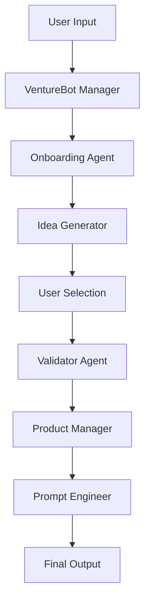

# React Chat UI Implementation Plan for AgentLab

## Overview

This document outlines the implementation plan for adding a React-based chat UI frontend to enhance the existing AgentLab ADK web interface. The goal is to create a minimal viable product (MVP) with chat functionality and agent status display.

## Current Architecture Analysis

### Existing Components
- **Backend**: FastAPI with Google ADK integration ([`main.py`](main.py))
- **Agent System**: Multi-agent framework with VentureBot manager ([`agentlab_v5/managerA/agent.py`](agentlab_v5/managerA/agent.py))
- **Database**: SQLite for session management ([`agentlab_v5/sessions.db`](agentlab_v5/sessions.db))
- **Web Interface**: Built-in ADK web interface (currently enabled)

### Agent Workflow


## Implementation Plan

### Phase 1: Project Setup and Backend Preparation

#### Task 1.1: Backend API Extensions
**Objective**: Extend FastAPI backend to support React frontend

**Files to modify**:
- [`main.py`](main.py) - Add new API endpoints and CORS

**New endpoints to add**:
```python
# Chat endpoints
POST /api/chat/{session_id}     # Send message to agent
GET  /api/chat/{session_id}     # Get chat history

# Status endpoints  
GET  /api/status/{session_id}   # Get current agent status
GET  /api/agents                # List available agents

# Session endpoints
POST /api/sessions              # Create new session
GET  /api/sessions/{session_id} # Get session info
DELETE /api/sessions/{session_id} # End session

# WebSocket endpoint
WS   /ws/{session_id}          # Real-time communication
```

**CORS Configuration**:
```python
from fastapi.middleware.cors import CORSMiddleware

app.add_middleware(
    CORSMiddleware,
    allow_origins=["http://localhost:3000"],  # React dev server
    allow_credentials=True,
    allow_methods=["*"],
    allow_headers=["*"],
)
```

#### Task 1.2: React Project Initialization
**Objective**: Set up React application structure

**Location**: `frontend/` directory in AgentLab root

**Dependencies to install**:
```json
{
  "dependencies": {
    "react": "^18.2.0",
    "react-dom": "^18.2.0",
    "axios": "^1.6.0",
    "socket.io-client": "^4.7.0",
    "styled-components": "^6.1.0",
    "@emotion/react": "^11.11.0",
    "@emotion/styled": "^11.11.0"
  }
}
```

**Project structure**:
```
frontend/
├── public/
│   ├── index.html
│   └── favicon.ico
├── src/
│   ├── components/
│   │   ├── ChatInterface/
│   │   │   ├── ChatContainer.jsx
│   │   │   ├── MessageList.jsx
│   │   │   ├── MessageInput.jsx
│   │   │   └── Message.jsx
│   │   └── AgentStatus/
│   │       ├── StatusDisplay.jsx
│   │       └── AgentIndicator.jsx
│   ├── services/
│   │   ├── api.js
│   │   └── websocket.js
│   ├── hooks/
│   │   ├── useChat.js
│   │   └── useAgentStatus.js
│   ├── styles/
│   │   └── globals.css
│   ├── App.jsx
│   └── index.js
├── package.json
└── .env
```

### Phase 2: Core Chat Interface Development

#### Task 2.1: Chat Component Architecture

**ChatContainer.jsx** - Main chat wrapper component:
```jsx
const ChatContainer = () => {
  const [sessionId, setSessionId] = useState(null);
  const { messages, sendMessage, isLoading } = useChat(sessionId);
  const { agentStatus, currentAgent } = useAgentStatus(sessionId);

  return (
    <div className="chat-container">
      <AgentStatus status={agentStatus} agent={currentAgent} />
      <MessageList messages={messages} />
      <MessageInput onSend={sendMessage} disabled={isLoading} />
    </div>
  );
};
```

**MessageList.jsx** - Display chat history:
```jsx
const MessageList = ({ messages }) => {
  return (
    <div className="message-list">
      {messages.map((message, index) => (
        <Message 
          key={index}
          content={message.content}
          sender={message.sender}
          timestamp={message.timestamp}
        />
      ))}
    </div>
  );
};
```

**MessageInput.jsx** - User input component:
```jsx
const MessageInput = ({ onSend, disabled }) => {
  const [input, setInput] = useState('');

  const handleSubmit = (e) => {
    e.preventDefault();
    if (input.trim() && !disabled) {
      onSend(input);
      setInput('');
    }
  };

  return (
    <form onSubmit={handleSubmit} className="message-input">
      <input
        type="text"
        value={input}
        onChange={(e) => setInput(e.target.value)}
        placeholder="Type your message..."
        disabled={disabled}
      />
      <button type="submit" disabled={disabled || !input.trim()}>
        Send
      </button>
    </form>
  );
};
```

#### Task 2.2: Agent Status Display

**StatusDisplay.jsx** - Show current agent information:
```jsx
const StatusDisplay = ({ status, agent }) => {
  return (
    <div className="agent-status">
      <AgentIndicator status={status} />
      <div className="agent-info">
        <span className="agent-name">{agent || 'VentureBot'}</span>
        <span className="agent-status-text">{status}</span>
      </div>
    </div>
  );
};
```

**AgentIndicator.jsx** - Visual status indicator:
```jsx
const AgentIndicator = ({ status }) => {
  const getStatusColor = (status) => {
    switch (status) {
      case 'active': return '#4CAF50';
      case 'thinking': return '#FF9800';
      case 'waiting': return '#2196F3';
      default: return '#9E9E9E';
    }
  };

  return (
    <div 
      className="status-indicator"
      style={{ backgroundColor: getStatusColor(status) }}
    />
  );
};
```

### Phase 3: Integration and Communication

#### Task 3.1: API Integration Layer

**api.js** - HTTP client for REST endpoints:
```javascript
import axios from 'axios';

const API_BASE_URL = process.env.REACT_APP_API_URL || 'http://localhost:8080';

const api = axios.create({
  baseURL: API_BASE_URL,
  headers: {
    'Content-Type': 'application/json',
  },
});

export const chatAPI = {
  createSession: () => api.post('/api/sessions'),
  sendMessage: (sessionId, message) => 
    api.post(`/api/chat/${sessionId}`, { message }),
  getChatHistory: (sessionId) => api.get(`/api/chat/${sessionId}`),
  getAgentStatus: (sessionId) => api.get(`/api/status/${sessionId}`),
};
```

**websocket.js** - WebSocket client for real-time updates:
```javascript
import io from 'socket.io-client';

class WebSocketService {
  constructor() {
    this.socket = null;
    this.listeners = new Map();
  }

  connect(sessionId) {
    const wsUrl = process.env.REACT_APP_WS_URL || 'ws://localhost:8080';
    this.socket = io(`${wsUrl}/ws/${sessionId}`);
    
    this.socket.on('agent_response', (data) => {
      this.emit('message', data);
    });
    
    this.socket.on('agent_status', (data) => {
      this.emit('status', data);
    });
  }

  emit(event, data) {
    const listeners = this.listeners.get(event) || [];
    listeners.forEach(callback => callback(data));
  }

  on(event, callback) {
    if (!this.listeners.has(event)) {
      this.listeners.set(event, []);
    }
    this.listeners.get(event).push(callback);
  }

  disconnect() {
    if (this.socket) {
      this.socket.disconnect();
      this.socket = null;
    }
  }
}

export default new WebSocketService();
```

#### Task 3.2: Custom React Hooks

**useChat.js** - Chat functionality hook:
```javascript
import { useState, useEffect } from 'react';
import { chatAPI } from '../services/api';
import websocketService from '../services/websocket';

export const useChat = (sessionId) => {
  const [messages, setMessages] = useState([]);
  const [isLoading, setIsLoading] = useState(false);

  useEffect(() => {
    if (sessionId) {
      // Load chat history
      chatAPI.getChatHistory(sessionId)
        .then(response => setMessages(response.data.messages))
        .catch(console.error);

      // Listen for new messages
      websocketService.on('message', (message) => {
        setMessages(prev => [...prev, message]);
        setIsLoading(false);
      });
    }
  }, [sessionId]);

  const sendMessage = async (content) => {
    if (!sessionId) return;

    const userMessage = {
      content,
      sender: 'user',
      timestamp: new Date().toISOString(),
    };

    setMessages(prev => [...prev, userMessage]);
    setIsLoading(true);

    try {
      await chatAPI.sendMessage(sessionId, content);
    } catch (error) {
      console.error('Failed to send message:', error);
      setIsLoading(false);
    }
  };

  return { messages, sendMessage, isLoading };
};
```

**useAgentStatus.js** - Agent status hook:
```javascript
import { useState, useEffect } from 'react';
import { chatAPI } from '../services/api';
import websocketService from '../services/websocket';

export const useAgentStatus = (sessionId) => {
  const [agentStatus, setAgentStatus] = useState('idle');
  const [currentAgent, setCurrentAgent] = useState('VentureBot');

  useEffect(() => {
    if (sessionId) {
      // Get initial status
      chatAPI.getAgentStatus(sessionId)
        .then(response => {
          setAgentStatus(response.data.status);
          setCurrentAgent(response.data.agent);
        })
        .catch(console.error);

      // Listen for status updates
      websocketService.on('status', (statusData) => {
        setAgentStatus(statusData.status);
        setCurrentAgent(statusData.agent);
      });
    }
  }, [sessionId]);

  return { agentStatus, currentAgent };
};
```

### Phase 4: UI/UX Implementation

#### Task 4.1: Styling and Layout

**globals.css** - Base styles:
```css
* {
  margin: 0;
  padding: 0;
  box-sizing: border-box;
}

body {
  font-family: -apple-system, BlinkMacSystemFont, 'Segoe UI', 'Roboto', sans-serif;
  background-color: #f5f5f5;
}

.chat-container {
  display: flex;
  flex-direction: column;
  height: 100vh;
  max-width: 800px;
  margin: 0 auto;
  background: white;
  box-shadow: 0 0 20px rgba(0,0,0,0.1);
}

.agent-status {
  display: flex;
  align-items: center;
  padding: 1rem;
  background: #f8f9fa;
  border-bottom: 1px solid #e9ecef;
}

.status-indicator {
  width: 12px;
  height: 12px;
  border-radius: 50%;
  margin-right: 0.5rem;
}

.message-list {
  flex: 1;
  overflow-y: auto;
  padding: 1rem;
}

.message {
  margin-bottom: 1rem;
  padding: 0.75rem 1rem;
  border-radius: 18px;
  max-width: 70%;
}

.message.user {
  background: #007bff;
  color: white;
  margin-left: auto;
}

.message.agent {
  background: #e9ecef;
  color: #333;
}

.message-input {
  display: flex;
  padding: 1rem;
  border-top: 1px solid #e9ecef;
}

.message-input input {
  flex: 1;
  padding: 0.75rem;
  border: 1px solid #ddd;
  border-radius: 20px;
  margin-right: 0.5rem;
  outline: none;
}

.message-input button {
  padding: 0.75rem 1.5rem;
  background: #007bff;
  color: white;
  border: none;
  border-radius: 20px;
  cursor: pointer;
}

.message-input button:disabled {
  background: #6c757d;
  cursor: not-allowed;
}
```

### Phase 5: Integration with Existing ADK

#### Task 5.1: FastAPI Static File Serving

**Updated main.py**:
```python
import os
from fastapi import FastAPI
from fastapi.staticfiles import StaticFiles
from fastapi.responses import FileResponse
from google.adk.cli.fast_api import get_fast_api_app

# ... existing code ...

# Mount React build files
if os.path.exists("frontend/build"):
    app.mount("/static", StaticFiles(directory="frontend/build/static"), name="static")
    
    @app.get("/")
    async def serve_react_app():
        return FileResponse("frontend/build/index.html")
    
    @app.get("/{path:path}")
    async def serve_react_routes(path: str):
        # Serve React app for all non-API routes
        if not path.startswith("api/"):
            return FileResponse("frontend/build/index.html")
```

#### Task 5.2: Development Configuration

**package.json proxy configuration**:
```json
{
  "name": "agentlab-frontend",
  "proxy": "http://localhost:8080",
  "scripts": {
    "start": "react-scripts start",
    "build": "react-scripts build",
    "dev": "REACT_APP_API_URL=http://localhost:8080 npm start"
  }
}
```

**Environment variables (.env)**:
```env
REACT_APP_API_URL=http://localhost:8080
REACT_APP_WS_URL=ws://localhost:8080
```

### Phase 6: Docker Integration

#### Task 6.1: Updated Dockerfile

```dockerfile
# Multi-stage build for React frontend
FROM node:18-alpine AS frontend-build
WORKDIR /app/frontend
COPY frontend/package*.json ./
RUN npm ci --only=production
COPY frontend/ ./
RUN npm run build

# Main Python application
FROM python:3.9-slim
WORKDIR /app

# Install Python dependencies
COPY requirements.txt .
RUN pip install --no-cache-dir -r requirements.txt

# Copy application code
COPY . .

# Copy React build from frontend stage
COPY --from=frontend-build /app/frontend/build ./frontend/build

# Expose port
EXPOSE 80

# Start application
CMD ["python", "main.py"]
```

#### Task 6.2: Docker Compose for Development

**docker-compose.dev.yml**:
```yaml
version: '3.8'
services:
  backend:
    build: .
    ports:
      - "8080:80"
    environment:
      - ANTHROPIC_API_KEY=${ANTHROPIC_API_KEY}
      - OPENAI_API_KEY=${OPENAI_API_KEY}
    volumes:
      - .:/app
    command: python main.py

  frontend:
    build:
      context: ./frontend
      dockerfile: Dockerfile.dev
    ports:
      - "3000:3000"
    volumes:
      - ./frontend:/app
      - /app/node_modules
    environment:
      - REACT_APP_API_URL=http://localhost:8080
```

## Implementation Timeline

### Week 1: Foundation
- [ ] Task 1.1: Backend API extensions
- [ ] Task 1.2: React project setup
- [ ] Basic project structure creation

### Week 2: Core Components
- [ ] Task 2.1: Chat component architecture
- [ ] Task 2.2: Agent status display
- [ ] Basic UI layout and styling

### Week 3: Integration
- [ ] Task 3.1: API integration layer
- [ ] Task 3.2: Custom React hooks
- [ ] WebSocket communication setup

### Week 4: Polish and Testing
- [ ] Task 4.1: UI/UX improvements
- [ ] Error handling and edge cases
- [ ] Component testing

### Week 5: Deployment
- [ ] Task 5.1: Static file serving
- [ ] Task 5.2: Development workflow
- [ ] Docker integration

### Week 6: Final Testing
- [ ] Integration testing
- [ ] Performance optimization
- [ ] Documentation updates

## Success Criteria

### MVP Requirements
- [ ] Users can send messages through React chat interface
- [ ] Agent responses are displayed in real-time
- [ ] Current agent status is visible
- [ ] Session management works correctly
- [ ] Interface is responsive and user-friendly

### Technical Requirements
- [ ] React frontend communicates with FastAPI backend
- [ ] WebSocket connection for real-time updates
- [ ] Proper error handling and loading states
- [ ] Docker deployment works correctly
- [ ] Development environment is set up properly

## Future Enhancements (Post-MVP)

1. **Enhanced Agent Visualization**
   - Agent workflow progress indicator
   - Memory state viewer
   - Agent transition animations

2. **Advanced Chat Features**
   - Message history persistence
   - File upload support
   - Rich text formatting

3. **User Experience Improvements**
   - Dark/light theme toggle
   - Customizable chat interface
   - Keyboard shortcuts

4. **Collaboration Features**
   - Multi-user sessions
   - Shared workspaces
   - Real-time collaboration

5. **Analytics and Monitoring**
   - Usage analytics dashboard
   - Agent performance metrics
   - User interaction tracking

## Technical Notes

### Agent Memory Integration
The React UI should integrate with the existing agent memory system:
- `memory['IdeaCoach']`: Generated ideas
- `memory['SelectedIdea']`: User-selected idea
- `memory['Validator']`: Validation results
- `memory['PRD']`: Product requirements
- `memory['BuilderPrompt']`: Final prompt

### WebSocket Message Format
```json
{
  "type": "agent_response",
  "data": {
    "content": "Agent response text",
    "agent": "idea_generator",
    "timestamp": "2024-01-01T00:00:00Z",
    "memory_updates": {
      "IdeaCoach": [...],
      "SelectedIdea": "..."
    }
  }
}
```

### Error Handling Strategy
- Network errors: Show retry button
- API errors: Display user-friendly messages
- WebSocket disconnection: Auto-reconnect with exponential backoff
- Session expiration: Redirect to new session creation

This implementation plan provides a comprehensive roadmap for creating a React-based chat UI that enhances the existing AgentLab ADK web interface while maintaining all current functionality.